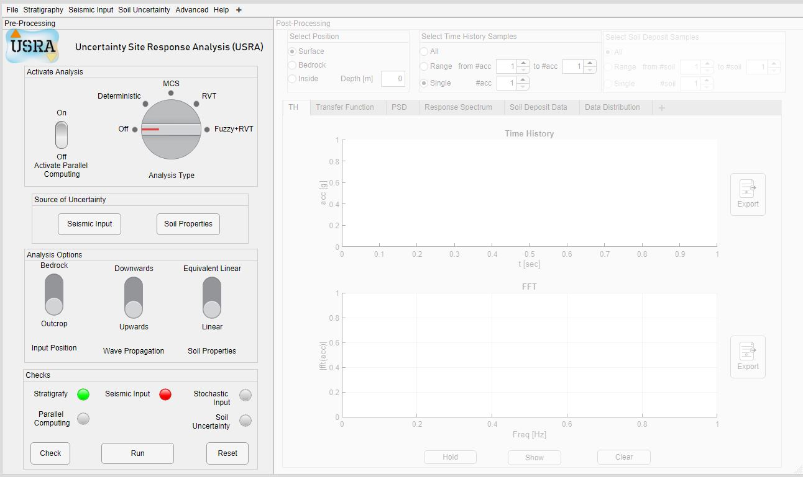
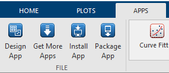

# USRA 


>[!NOTE]
> The GUI is still incomplete.
> Currently, the engine is limited to uncertainty analysis considering stochastic earthquake motion. Developments will involve the fuzzification of the soil properties

---
:pushpin:
 USRA  is released under the Apache License 2.0 and is free.
 
:pushpin:
 USRA is a site response analysis considering random and/or fuzzy inputs

:camera: Screenshot of the GUI:


## Reference
 
 ---
 >  A. Tombari and L. Stefanini, ‘Hybrid fuzzy – stochastic 1D site response analysis accounting for soil uncertainties’, Mechanical Systems and Signal Processing, vol. 132, pp. 102–121, Oct. 2019, doi: 10.1016/j.ymssp.2019.06.005.

The  paper can be read at [Mechanical Systems and Signal Processing weblink]([https://doi.org/10.1016/j.compgeo.2023.105967](https://doi.org/10.1016/j.ymssp.2019.06.005))


BibTex code for referencing:

```BibTex
@article{tombari_hybrid_2019,
	title = {Hybrid fuzzy – stochastic {1D} site response analysis accounting for soil uncertainties},
	volume = {132},
	issn = {08883270},
	url = {https://linkinghub.elsevier.com/retrieve/pii/S0888327019303887},
	doi = {10.1016/j.ymssp.2019.06.005},
	language = {en},
	urldate = {2022-09-16},
	journal = {Mechanical Systems and Signal Processing},
	author = {Tombari, Alessandro and Stefanini, Luciano},
	month = oct,
	year = {2019},
	pages = {102--121},
}
```

## Guidance

### MATLAB APP Installation

1. Download MATLAB APP from XXX
2. Open  MATLAB and go to the APP tool
    
3. Click on Install App and select the _USRA.mlappinstall_ file
4. USRA app will appear in the toolbar
5. Open USRA


## Worked Example
A step-by-step worked example is provided in the video ( :mute: ) below.

XXXX


